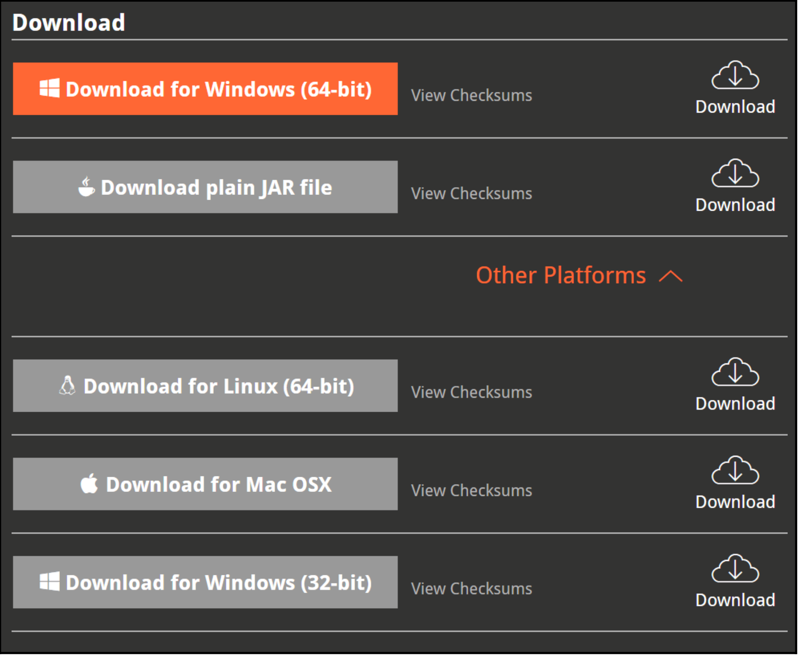
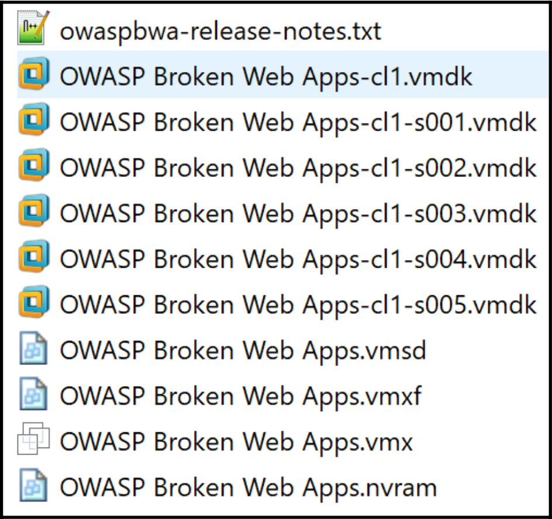
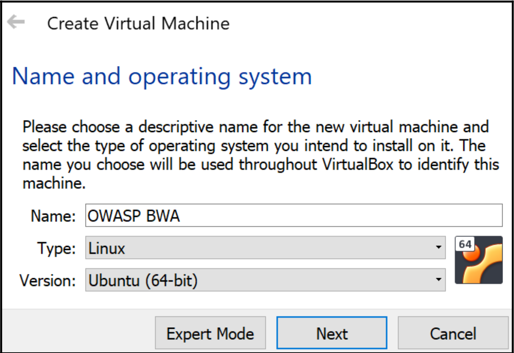
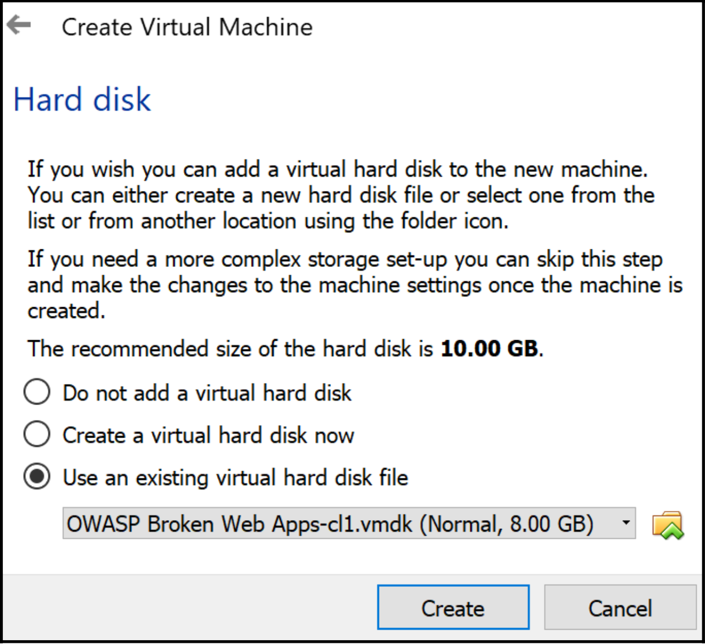
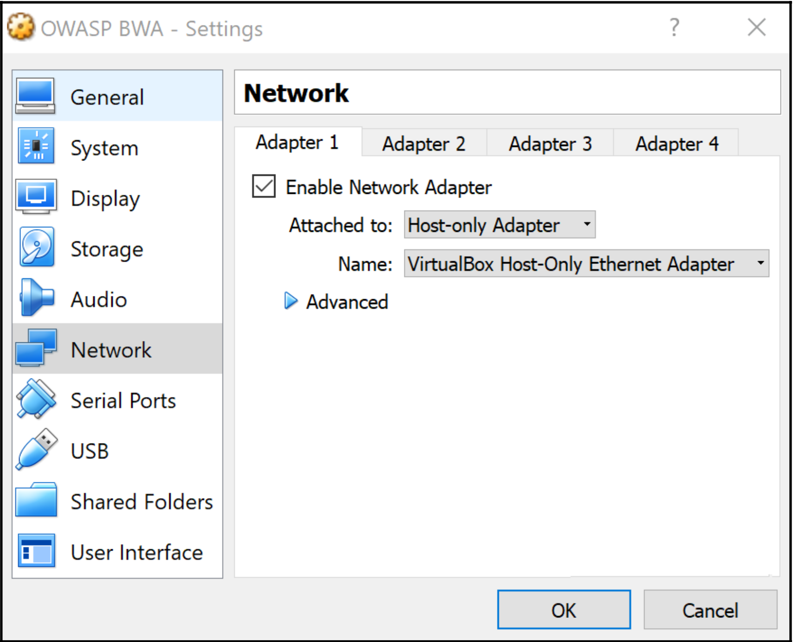
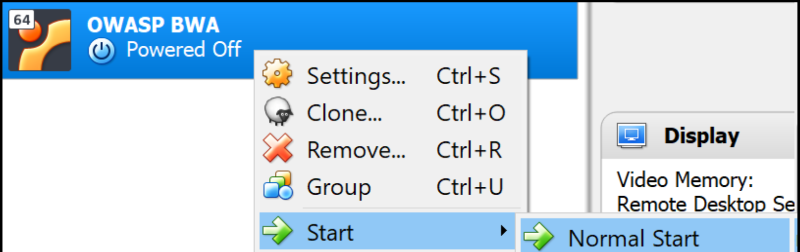
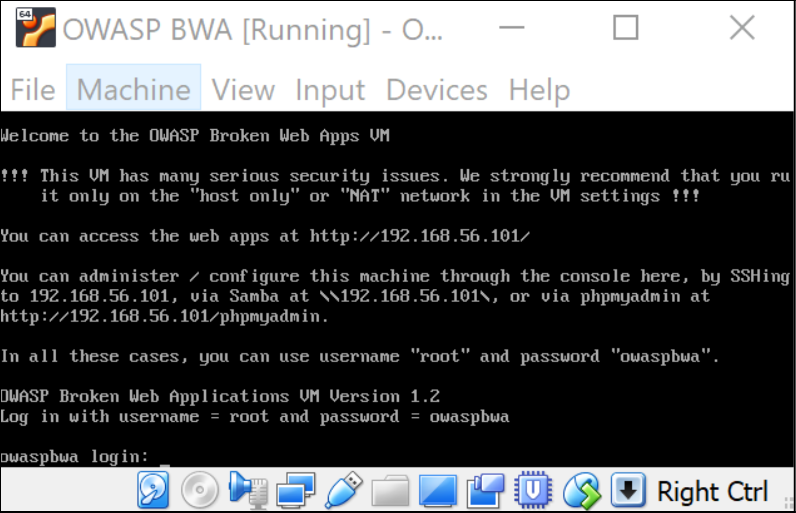
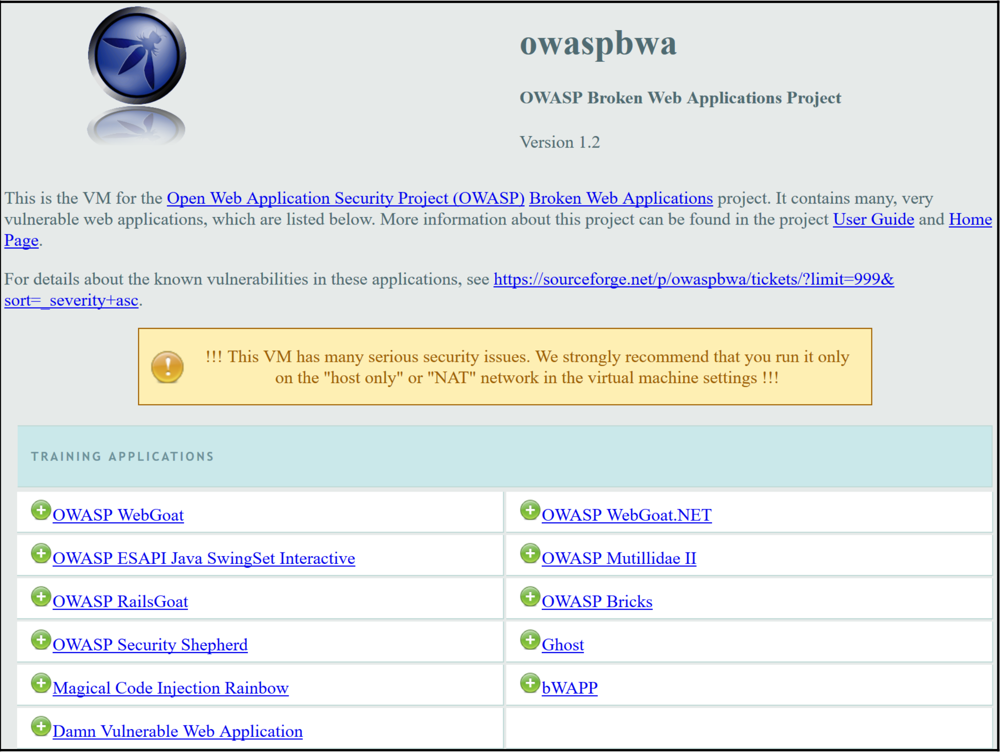

### Software tool requirements

To complete this recipe, you will need the following:

* *Oracle Java* (`https://www.java.com/en/download/`)
* *Burp Proxy Community* or *Professional* (`https://portswigger.net/burp/`)
* *Firefox Browser* (`https://www.mozilla.org/en-US/firefox/new/`)

### Comment procéder...
Après avoir choisi l'édition dont vous avez besoin, vous avez deux options d'installation, à savoir un exécutable ou un simple fichier *JAR*. L'exécutable est uniquement disponible sous Windows et est proposé en 32 ou 64 bits. Le fichier *JAR* simple est disponible pour Windows, *macOS* et *Linux*.

L'exécutable *Windows* est autonome et crée des icônes dans la liste de vos programmes. Toutefois, le fichier *JAR* brut nécessite que *Java* (`https://www.java.com/fr/download/`) soit préinstallé sur votre plate-forme. Vous pouvez choisir la version actuelle de Java (*JRE* ou *JDK*), alors n'hésitez pas à choisir la dernière version :

    { width=50% }

### Mise en place d'un "web app pentesting lab"

Le projet *Broken Web Application (BWA)* est un projet de l'*OWASP* qui fournit une *VM* autonome contenant une variété d'applications présentant des vulnérabilités connues. Les applications de cette *VM* permettent aux étudiants de se familiariser avec la sécurité des applications Web, de pratiquer et d'observer des attaques Web et d'utiliser des outils de pénétration tels que *Burp*.
Pour suivre les *recipes*, nous utiliserons la *VM BWA* de l'*OWASP* (`https://sourceforge.net/ projects/owaspbwa/files/`).

### Outil logiciel requis
Pour réaliser cette *recipe*, vous aurez besoin des éléments suivants :
*Oracle VirtualBox* (`https://www.virtualbox.org/wiki/Downloads`) Choisissez un exécutable spécifique à votre plateforme

* Navigateur *Mozilla Firefox* (`https://www.mozilla.org/en-US/firefox/new/`)  
* Archiveur de fichiers *7-Zip* (`https://www.7-zip.org/download.html`)  
* *OWASP BWA VM* (`https://sourceforge.net/projects/owaspbwa/files/`)  
* *Burp Proxy Community* ou *Professional* (`https://portswigger.net/burp/`)  
* *Oracle Java* (`https://www.java.com/en/download/`)  

### How to do it ...
Pour cette *recipe*, vous devez télécharger la *VM OWASP BWA* et l'installer en effectuant les étapes suivantes :

1\. Cliquez sur `Download Latest Version` à partir du lien *OWASP BWA VM* fourni précédemment et décompressez le fichier `OWASP_Broken_Web_Apps_VM_1.2.7z`.

2\. Vous obtiendrez la liste de fichiers suivante :   

    { width=40% }

3\. Toutes les extensions de fichiers indiquées indiquent que la *VM* peut être importée dans *Oracle VirtualBox* ou *VMware Player/Workstation*. Pour la mise en place du *laboratoire de pentesting d'applications Web*, nous utiliserons *Oracle VirtualBox*.

4\. Prenez note du fichier `OWASP Broken Web Apps-cl1.vmdk`. Ouvrez le *VirtualBox Manager* (c'est-à-dire le programme *Oracle VM VirtualBox*).

5\. Dans l'écran *VirtualBox Manager*, sélectionnez `Machine | New` dans le menu supérieur et tapez un nom pour la machine, *OWASP BWA*.

6\. Définissez le type sur *Linux* et la version sur *Ubuntu (64 bits)*, puis cliquez sur Suivant, comme suit :

    { width=50% }

7\. L'écran suivant vous permet d'ajuster la *RAM* ou de la laisser telle quelle. Cliquez sur Suivant.

8\. Sur l'écran suivant, choisissez Utiliser un fichier de disque dur virtuel existant.

9\. Utilisez l'icône de dossier sur la droite pour sélectionner le fichier `OWASP Broken Web Apps-cl1.vmdk`
dans la liste extraite et cliquez sur Créer, comme suit :

    { width=50% }

10\. Votre *VM* est maintenant chargée dans le gestionnaire *VirtualBox*. Faisons quelques ajustements mineurs. Mettez en évidence l'entrée *OWASP BWA* et sélectionnez `Settings` dans le menu supérieur.

11\. Sélectionnez la section Network (Réseau) dans le volet de gauche et changez pour *Host-only Adapter* (Adaptateur hôte uniquement). Cliquez sur `OK`.

    { width=50% }

12\. Maintenant, démarrons la machine virtuelle. Cliquez avec le bouton droit de la souris et choisissez `start | Normal Start`. 

    { width=50% }

13\. Attendez que le système Linux soit complètement démarré, ce qui peut prendre quelques minutes. Une fois le processus de démarrage terminé, vous devriez voir l'écran suivant. Cependant, l'adresse IP affichée sera différente pour votre machine :

    { width=50% }

14\. Les informations présentées sur cet écran identifient l'*URL* à partir de laquelle vous pouvez accéder aux applications Web vulnérables exécutées sur la *VM*. Par exemple, dans la capture d'écran précédente, l'*URL* est `http://192.168.56.101/`. Vous êtes invité à administrer la *VM*, mais il n'est pas nécessaire de vous connecter pour le moment.

15\. Ouvrez le navigateur *Firefox* sur votre système hôte, et non dans la *VM*. En utilisant le navigateur *Firefox* sur votre machine hôte, entrez l'*URL* fournie (par exemple, `http://192.168.56.101/`), où l'adresse *IP* est spécifique à votre machine.

16\. Dans votre navigateur, une page d'index contenant des liens vers des applications web vulnérables vous est présentée. Ces applications seront utilisées comme cibles :

    { width=50% }

Comment cela fonctionne
En utilisant une machine virtuelle personnalisée créée par l'OWASP, nous pouvons rapidement mettre en place un laboratoire de pentesting d'applications Web contenant des applications volontairement vulnérables, que nous pouvons utiliser comme cibles légales pour nos exercices tout au long de ce livre.

Démarrage de Burp à partir d'une ligne de commande ou en tant qu'exécutable
Pour les utilisateurs non-Windows ou les utilisateurs Windows qui ont choisi l'option du fichier JAR simple, vous lancerez Burp à partir d'une ligne de commande chaque fois qu'ils souhaiteront l'exécuter. En tant que tel, vous aurez besoin d'une commande Java particulière pour le faire.
Dans certaines circonstances, telles que les scripts automatisés, vous pouvez souhaiter invoquer Burp à la ligne de commande comme un élément de ligne dans votre script shell. En outre, vous pouvez souhaiter exécuter Burp sans interface utilisateur graphique (GUI), ce qui est appelé le mode sans tête. Cette section décrit comment effectuer ces tâches.
Comment faire...
Nous allons passer en revue les commandes et les actions requises pour démarrer le produit Burp Suite :
1. Démarrez Burp sous Windows, après avoir exécuté le programme d'installation à partir du fichier .exe téléchargé, en double-cliquant sur l'icône sur le bureau ou en le sélectionnant dans la liste des programmes :

Lorsque vous utilisez le fichier JAR simple, l'exécutable java est suivi de l'option -jar, puis du nom du fichier JAR à télécharger.
2. Démarrez Burp à la ligne de commande (minimale) avec le fichier JAR simple (Java doit être installé en premier) :

Si vous préférez contrôler davantage les paramètres de la taille du tas (c'est-à-dire la quantité de mémoire allouée au programme), vous pouvez modifier la commande java.

L'exécutable java est suivi du -jar, suivi de l'allocation de mémoire. Dans ce cas, 2 Go (c'est-à-dire 2g) sont alloués à la mémoire vive (RAM), suivis du nom du fichier JAR. Si vous obtenez une erreur indiquant que vous ne pouvez pas allouer autant de mémoire, réduisez simplement la quantité à quelque chose comme 1 024 Mo (c'est-à-dire 1024m).
Démarrez Burp en ligne de commande (optimize) avec le fichier JAR simple (Java doit être installé en premier) :

Il est possible de lancer Burp à partir de la ligne de commande et de l'exécuter en mode sans tête. Le mode sans tête signifie exécuter Burp sans l'interface graphique.
Pour les besoins de ce livre, nous ne lancerons pas Burp en mode headless, puisque nous apprenons à travers l'interface graphique. Cependant, vous pourrez avoir besoin de cette information dans le futur, c'est pourquoi elle est présentée ici.
Démarrez Burp à la ligne de commande pour l'exécuter en mode sans tête avec le fichier JAR simple (Java doit être installé en premier) :

Notez le placement du paramètre -Djava.awt.headless=true immédiatement après l'option -jar et avant le nom du fichier JAR.
En cas de succès, vous devriez voir ce qui suit :

Appuyez sur Ctrl + C ou Ctrl + Z pour arrêter le processus.
Il est possible de fournir un fichier de configuration à la commande mode sans tête pour
personnaliser le numéro de port et l'adresse IP où se trouve l'auditeur proxy.

Veuillez consulter les pages de support de PortSwigger pour plus d'informations sur ce sujet : https://support.portswigger.net/customer/portal/questions/ 16805563-burp-command-line.9. Dans chaque scénario de démarrage décrit, vous devriez être présenté avec un écran de démarrage. Le libellé de l'écran d'accueil correspondra à l'édition que vous avez décidé de télécharger, soit Professional ou Community.
10. Vous pouvez être invité à mettre à jour la version ; n'hésitez pas à le faire, si vous le souhaitez. De nouvelles fonctionnalités sont constamment ajoutées à Burp pour vous aider à trouver des vulnérabilités, la mise à jour de l'application est donc une bonne idée. Choisissez Mettre à jour maintenant, le cas échéant.
11. Ensuite, une boîte de dialogue vous demandant les fichiers et les configurations du projet vous est présentée :

Si vous utilisez l'édition Community, vous ne pourrez créer qu'un projet temporaire. Si vous utilisez l'édition Professional, créez un nouveau projet sur le disque, en l'enregistrant à un endroit approprié que vous pourrez retrouver. Cliquez sur Suivant.

L'écran d'accueil suivant vous demande quelles sont les configurations que vous souhaitez utiliser. A ce stade, nous n'en avons pas encore, donc choisissez Use Burp defaults. Au fur et à mesure que vous progresserez dans ce livre, vous souhaiterez peut-être enregistrer les paramètres de configuration et les charger à partir de cet écran de démarrage à l'avenir, comme suit :

Comment ça marche...
En utilisant le fichier JAR ou l'exécutable Windows, vous pouvez lancer Burp pour démarrer l'écouteur Proxy afin de capturer le trafic HTTP. Burp propose des fichiers de projet temporaires ou permanents pour sauvegarder les activités effectuées dans la suite.

Écouter le trafic HTTP, en utilisant Burp
Burp est décrit comme un proxy d'interception. Cela signifie que Burp se situe entre le navigateur Web de l'utilisateur et le serveur Web de l'application et intercepte ou capture tout le trafic circulant entre eux. Ce type de comportement est communément appelé "service proxy".
Les testeurs de pénétration utilisent des proxys d'interception pour capturer le trafic circulant entre un navigateur Web et une application Web à des fins d'analyse et de manipulation. Par exemple, un testeur peut mettre en pause n'importe quelle requête HTTP, ce qui permet de modifier les paramètres avant d'envoyer la requête au serveur Web.
Les proxys d'interception, tels que Burp, permettent aux testeurs d'intercepter à la fois les requêtes et les réponses HTTP. Cela permet au testeur d'observer le comportement de l'application web dans différentes conditions. Et, comme nous le verrons, parfois, les comportements ne correspondent pas à ce que le développeur initial attendait.
Pour voir la suite Burp en action, nous devons configurer les paramètres réseau de notre navigateur Firefox pour pointer vers notre instance de Burp en cours d'exécution. Cela permet à Burp de capturer tout le trafic HTTP qui circule entre votre navigateur et l'application web cible.

Préparation
Nous allons configurer le navigateur Firefox pour permettre à Burp d'écouter tout le trafic HTTP circulant entre le navigateur et la OWASP BWA VM. Cela permettra au service proxy de Burp de capturer le trafic à des fins de test.
Les instructions sont disponibles sur PortSwigger à (https://support.portswigger.net/ customer/portal/articles/1783066-configuring-firefox-to-work-with-burp) et nous allons également suivre le processus dans la recette suivante.
Comment procéder...
Voici les étapes que vous pouvez suivre pour écouter tout le trafic HTTP en utilisant Burp : 1. Ouvrez le navigateur Firefox et allez dans Options.
2. Dans l'onglet Général, faites défiler jusqu'à la section Proxy réseau, puis cliquez sur Paramètres.
3. Dans les Paramètres de connexion, sélectionnez Configuration manuelle du proxy et saisissez l'adresse IP de 127.0.0.1 avec le port 8080. Cochez la case Utiliser ce serveur proxy pour tous les protocoles :

Assurez-vous que la zone de texte No proxy for the textbox est vide, comme indiqué dans la capture d'écran suivante, puis cliquez sur OK :

Avec la VM OWASP BWA fonctionnant en arrière-plan et en utilisant Firefox pour naviguer vers l'URL spécifique à votre machine (c'est-à-dire l'adresse IP affichée sur la VM Linux dans VirtualBox), cliquez sur le bouton de rechargement (la flèche dans un cercle) pour voir le trafic capturé dans Burp.

Si vous ne voyez pas de trafic, vérifiez si Proxy Intercept bloque la demande. Si le bouton intitulé Intercept is on est enfoncé, comme le montre la capture d'écran suivante, cliquez à nouveau sur ce bouton pour désactiver l'interception. Après avoir fait cela, le trafic devrait s'écouler librement dans Burp, comme suit :

Dans l'exemple suivant, le bouton Proxy | Intercept est désactivé :

Si tout fonctionne correctement, vous verrez sur votre onglet Cible | Plan du site un trafic similaire à celui illustré dans la capture d'écran suivante. Votre adresse IP sera différente, bien sûr, et vous aurez peut-être plus d'éléments affichés dans votre plan du site. Félicitations ! Burp est maintenant à l'écoute de tout le trafic de votre navigateur !

Comment cela fonctionne...
Le service Burp Proxy écoute sur 127.0.0.1 port 8080. L'un ou l'autre de ces paramètres peut être modifié pour écouter sur une autre adresse IP ou un autre numéro de port. Toutefois, pour les besoins de l'apprentissage, nous utiliserons les paramètres par défaut.

Getting to Know the Burp Su2ite of Tools
In this chapter, we will cover the following recipes:
Setting the Target Site Map Understanding Message Editor Repeating with Repeater Decoding with Decoder Intruding with Intruder
Introduction
This chapter provides overviews of the most commonly used tools within Burp Suite. The chapter begins by establishing the Target scope within the Target Site Map. This is followed by an introduction to the Message Editor. Then, there will be some hands-on recipes using OWASP Mutillidae II to get acquainted with Proxy, Repeater, Decoder, and Intruder.
Getting to Know the Burp Suite of Tools Chapter 2
 Software tool requirements
To complete the recipes in this chapter, you will need the following:
Burp Proxy Community or Professional (https:/​/​portswigger.​net/​burp/​)
The Firefox browser configured to allow Burp to proxy traffic (https:/​/​www. mozilla.​org/​en-​US/​firefox/​new/​)
Setting the Target Site Map
Now that we have traffic flowing between your browser, Burp, and the OWASP BWA virtual machine, we can begin setting the scope of our test. For this recipe, we will use the OWASP Mutillidae II link (http://<Your_VM_Assigned_IP_Address>/mutillidae/) available in the OWASP BWA VM as our target application.
Looking more closely at the Target tab, you will notice there are two subtabs available: Site map and Scope. From the initial proxy setup between your browser, Burp, and the web server, you should now have some URLs, folders, and files shown in the Target | Site map tab. You may find the amount of information overwhelming, but setting the scope for our project will help to focus our attention better.
Getting ready
Using the Target | Site map and Target | Scope tab, we will assign the URL for mutillidae (http://<Your_VM_Assigned_IP_Address>/mutillidae/) as the scope.
[ 26 ]

Getting to Know the Burp Suite of Tools Chapter 2
 How to do it...
Execute the following steps to set the Target Site Map:
1. Search for the folder mutillidae and right-click on Add to scope. Notice the
brief highlighting of the Target | Scope subtab, as follows:

Après avoir ajouté le dossier mutillidae à votre champ d'application, une boîte de dialogue de journalisation de l'historique du proxy peut s'afficher, comme suit. Vous pouvez choisir d'éviter de collecter les messages hors de votre chape en cliquant sur Oui. Ou vous pouvez choisir de continuer à faire en sorte que la table d'historique HTTP du proxy collecte tous les messages passant par Burp, même si ces messages sortent de la portée que vous avez identifiée. Pour nos besoins, nous choisirons Oui :
3. En retournant l'onglet Target | Scope, vous devriez maintenant voir l'URL complète de l'OWASP Mutillidae II, indiquée dans le tableau Include in scope, comme suit :
      [ 28 ]

Apprendre à connaître la suite d'outils Burp Chapitre 2
      Comment ça marche...
L'éditeur de messages affiche des informations détaillées sur tout message HTTP passant par l'écouteur Proxy. Après avoir configuré le Proxy pour capturer le trafic HTTP, comme vous pouvez le voir dans l'onglet Cible | Plan du site et Burp Proxy | Historique HTTP, vous pouvez sélectionner un seul message pour faire apparaître l'éditeur de messages. Chaque éditeur contient les côtés demande et réponse du message, à condition que le message soit correctement proxié par Burp.
[ 29 ]

Apprendre à connaître la suite d'outils Burp Chapitre 2
 Comprendre l'éditeur de message
Sur presque tous les outils et onglets de la suite Burp qui affichent un message HTTP, vous verrez un éditeur identifiant la demande et la réponse. C'est ce qu'on appelle communément l'éditeur de messages. L'éditeur de messages permet de visualiser et de modifier les demandes et les réponses HTTP avec des spécialités.
L'éditeur de messages comporte plusieurs sous-onglets. Les sous-onglets d'un message de demande comprennent au minimum les éléments suivants :
En-têtes bruts Hex
Les sous-onglets d'un message de réponse comprennent les éléments suivants :
Brut
En-têtes bruts
Hex
HTML (parfois) Rendu (parfois)
L'onglet Raw vous donne le message sous sa forme HTTP brute. L'onglet En-têtes affiche les paramètres des en-têtes HTTP sous forme de tableau. Les paramètres sont éditables, et des colonnes peuvent être ajoutées, supprimées ou modifiées dans le tableau dans des outils tels que Proxy et Repeater.
Pour les requêtes contenant des paramètres ou des cookies, l'onglet Params est présent. Les paramètres sont éditables, et des colonnes peuvent être ajoutées, supprimées ou modifiées dans le tableau au sein d'outils tels que Proxy et Repeater.
Enfin, il y a l'onglet Hex, qui présente le message au format hexadécimal ; il s'agit, en fait, d'un éditeur hexadécimal. Vous êtes autorisé à modifier des octets individuels dans des outils tels que Proxy et Repeater, mais ces valeurs doivent être indiquées sous forme hexadécimale à deux chiffres, de 00 à FF.
[ 30 ]

Apprendre à connaître la suite d'outils Burp Chapitre 2
 Se préparer
Explorons les multiples onglets disponibles dans l'éditeur de messages pour chaque requête et réponse capturée dans Burp.
Comment faire...
Assurez-vous que le trafic circule entre votre navigateur, Burp, et la machine virtuelle OWASP BWA.
1. En regardant l'onglet Target | Site map, remarquez la section Message Editor :
     [ 31 ]

Apprendre à connaître la suite d'outils Burp Chapitre 2
2. Lorsque vous visualisez une requête, notez que les sous-onglets disponibles comprennent Raw, Headers et Hex, au minimum. Cependant, dans le cas d'une requête contenant des paramètres ou des cookies, le sous-onglet Params est également disponible :
3. De l'autre côté du message se trouve l'onglet Response, qui contient les sous-onglets Raw, Headers, Hex, et parfois HTML et Render. Il s'agit des différents formats fournis pour la réponse HTTP à la demande. Si le contenu est en HTML, alors l'onglet apparaîtra. De même, l'onglet Render permet d'afficher le HTML tel qu'il serait présenté dans un navigateur mais sans qu'aucun JavaScript ne soit exécuté :
      [ 32 ]

Apprendre à connaître la suite d'outils Burp Chapitre 2
      Répétition avec Repeater
Repeater permet d'apporter de légères modifications ou ajustements à la demande, et celle-ci est affichée dans la fenêtre de gauche. Un bouton Go permet de réémettre la requête, et la réponse s'affiche dans la fenêtre de droite.
Les détails relatifs à votre requête HTTP comprennent les détails standard de l'éditeur de messages tels que Raw, Params (pour les requêtes avec paramètres ou cookies), Headers et Hex.
Les détails relatifs à la réponse HTTP comprennent les détails standard de l'éditeur de messages, notamment Raw, Headers, Hex et, parfois, HTML et Render.
En bas de chaque panneau se trouve un champ de recherche, permettant au testeur de trouver rapidement une valeur présente dans un message.
Se préparer
Repeater vous permet de modifier manuellement puis de réémettre une requête HTTP individuelle, en analysant la réponse que vous recevez.
[ 33 ]

Apprendre à connaître la suite d'outils Burp Chapitre 2
 Comment faire...
1. Dans les onglets Cible | Plan du site ou Proxy | Historique HTTP (illustrés dans la capture d'écran suivante), cliquez avec le bouton droit de la souris sur un message et sélectionnez Envoyer au répéteur :
2. Passez à l'onglet Répéteur. Notez que la requête HTTP est prête pour que le testeur modifie les paramètres, puis envoie la requête à l'application via le bouton Go.
le bouton Go.
     [ 34 ]

Apprendre à connaître la suite d'outils Burp Chapitre 2
Notez les boîtes de recherche au bas de chaque panneau :
Nous utiliserons Repeater assez souvent tout au long de ce livre. Ce chapitre est juste une introduction au Repeater et à la compréhension de son but.
Décodage avec Decoder
Burp Decoder est un outil Traduit avec www.DeepL.com/Translator (version gratuite)

Notez les boîtes de recherche au bas de chaque panneau :
Nous utiliserons Repeater assez souvent tout au long de ce livre. Ce chapitre est juste une introduction au Repeater et à la compréhension de son but.
Décodage avec Decoder
Burp Decoder est un outil qui permet au testeur de convertir des données brutes en données codées ou de prendre des données codées et de les reconvertir en texte brut. Decoder prend en charge plusieurs formats, notamment le codage URL, le codage HTML, le codage Base64, le code binaire, les données hachées, etc. Decoder comprend également un éditeur hexadécimal intégré.
Se préparer
Au fur et à mesure de l'avancement d'un test de pénétration du Web, un testeur peut tomber sur une valeur encodée. Burp facilite le processus de décodage en permettant au testeur d'envoyer la valeur codée au Decoder et d'essayer les différentes fonctions de décodage disponibles.
      [ 35 ]
  
Apprendre à connaître la suite d'outils Burp Chapitre 2
 Comment faire...
Essayons de décoder la valeur du jeton de session PHPSESSID trouvé dans l'application OWASP Mutillidae II. Lorsqu'un utilisateur navigue initialement sur l'URL (http://<Votre_VM_Assigned_IP_Address>/mutillidae/), un cookie PHPSESSID lui est attribué. La valeur PHPSESSID semble être cryptée, puis enveloppée dans un codage de base 64. En utilisant le Decoder, nous pouvons déballer la valeur.
1. Accédez à l'application http://<Votre_VM_Assigned_IP_Address>/mutillidae/.
2. Trouvez la requête HTTP que vous venez de générer à partir de votre navigation dans l'onglet Proxy | Historique HTTP (illustré dans la capture d'écran suivante). Mettez en surbrillance la valeur PHPSESSID, et non le nom du paramètre, faites un clic droit, et sélectionnez Send to Decoder :
     [ 36 ]
  
Apprendre à connaître la suite d'outils Burp Chapitre 2
3. Dans l'onglet Decoder, dans la liste déroulante Decode as... comme suit, sélectionnez Base 64. Notez que les résultats sont visualisés dans l'éditeur Hex et sont chiffrés :
Dans cet exemple, nous ne pouvons pas aller plus loin. Nous pouvons confirmer que la valeur était, en effet, enveloppée en Base 64. Cependant, la valeur qui est déballée est cryptée. Le but de cette recette est de vous montrer comment vous pouvez utiliser Decoder pour manipuler des valeurs codées.
Intrusion avec Intruder
L'Intruder de Burp permet à un testeur de forcer brutalement ou de fuzzer des portions spécifiques d'un message HTTP, en utilisant des charges utiles personnalisées.
      [ 37 ]
  
Apprendre à connaître la suite d'outils Burp Chapitre 2
Pour configurer correctement des attaques personnalisées dans Intruder, un testeur devra utiliser les paramètres disponibles dans les quatre sous-onglets d'Intruder :
Se préparer
Un testeur peut souhaiter fuzzer ou forcer brutalement des valeurs de paramètres dans un message. Burp Intruder facilite ce processus en fournissant différents styles d'attaques, charges utiles et options.
Comment procéder...
1. Accédez à l'écran de connexion de Mutillidae et essayez de vous connecter à l'application. Par exemple, saisissez le nom d'utilisateur admin et le mot de passe adminpass.
2. Trouvez la tentative de connexion dans l'onglet Proxy | Historique HTTP. Le numéro de votre demande (c'est-à-dire le signe # sur le côté gauche) sera différent de celui qui est indiqué ci-dessous. Sélectionnez le message qui a capturé votre tentative de connexion.
      [ 38 ]
  
Apprendre à connaître la suite d'outils Burp Chapitre 2
3. Lorsque le message de tentative de connexion est mis en évidence dans le tableau de l'historique HTTP, cliquez avec le bouton droit de la souris sur l'onglet Request, et sélectionnez Send to Intruder :
      [ 39 ]
  
Apprendre à connaître la suite d'outils Burp Chapitre 2
 Cible
L'onglet Cible de l'intrus définit votre application Web ciblée. Ces paramètres sont pré-remplis pour vous par Burp :
Positions
L'onglet Positions identifie l'endroit où les marqueurs de charge utile doivent être définis dans la section Payload | Positions. Pour nos besoins, cliquez sur le § Clear (c'est-à-dire les marqueurs de charge utile) dans le menu latéral droit. Sélectionnez manuellement le champ du mot de passe en le mettant en surbrillance avec votre curseur. Cliquez maintenant sur le bouton Ajouter § dans le menu latéral de droite. Les marqueurs de charge utile devraient entourer le champ du mot de passe comme suit :
          [ 40 ]
  
Apprendre à connaître la suite d'outils Burp Chapitre 2
 Charges utiles
Après l'onglet Positions se trouve l'onglet Charges utiles. L'onglet Payloads identifie les valeurs des listes de mots ou les nombres que vous souhaitez insérer dans les positions que vous avez identifiées dans l'onglet précédent. L'onglet Payloads comporte plusieurs sections, dont Payload Sets, Payload Options, Payload Processing et Payload Encoding.
Jeux de données utiles
La section Payload Sets permet de définir le nombre de charges utiles ainsi que leur type. Pour nos besoins, nous utiliserons les paramètres par défaut pour Sniper, ce qui nous permettra d'utiliser une charge utile avec un type de charge utile de type Liste simple :
Options de la charge utile
Dans la section Payload Options, un testeur peut configurer une charge utile personnalisée ou en charger une préconfigurée depuis un fichier.
     [ 41 ]
  
Apprendre à connaître la suite d'outils Burp Chapitre 2
Pour nos besoins, nous allons ajouter une valeur à notre charge utile. Dans la zone de texte, tapez admin, puis cliquez sur le bouton Add pour créer notre charge utile personnalisée :
Traitement des données utiles
Le traitement des charges utiles est utile pour configurer des règles spéciales à utiliser lorsqu'Intruder substitue des charges utiles aux positions des marqueurs de charges utiles. Pour cette recette, nous n'avons pas besoin de règles spéciales de traitement des charges utiles :
           [ 42 ]
  
Apprendre à connaître la suite d'outils Burp Chapitre 2
Encodage de la charge utile Traduit avec www.DeepL.com/Translator (version gratuite)

